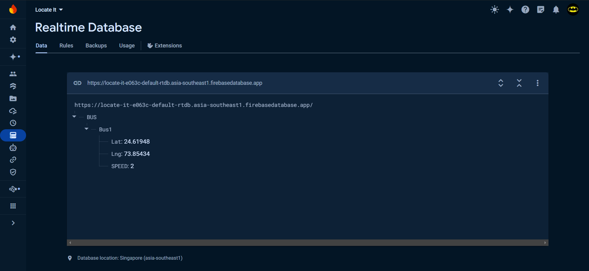

# City Bus Tracker
## Introduction
This project is a comprehensive live bus tracking system that integrates hardware, software, and machine learning components to provide real-time tracking of buses. The system is designed to enhance public transportation efficiency and improve commuter satisfaction by providing accurate, real-time information on bus locations and arrival times, with advanced predictions powered by machine learning.

## Features
<b> Real-Time Bus Tracking:</b> Uses GPS modules to provide accurate and continuous location updates for buses. User-Friendly Mobile Application: Developed using Flutter, the app displays real-time bus locations on an interactive map.

<b>Machine Learning Integration:</b> Employs machine learning models to predict bus arrival times and optimize routes based on historical data. This enhances the accuracy of bus schedules and helps in managing route efficiency.

<b>Firebase Backend:</b> Real-time database for data synchronization, user authentication, and cloud storage. Scalability and Reliability: Designed to handle a large number of users and buses efficiently.

## Technologies Used
<b>Machine Learning Frameworks:</b> TensorFlow and PyTorch for developing, training, and deploying machine learning models. These models analyze historical bus movement data, traffic patterns, and other variables to provide precise arrival time predictions and route optimizations.

<b>Hardware:</b> ESP01 module, NEO6M GPS module, microcontroller/processor.

<b>Software:</b> Flutter, Google Maps API, Firebase.

<b>Development Tools:</b> Visual Studio Code, Android Studio.

<b>Communication Protocols:</b> TCP/IP, HTTP.

## Screenshots

### Mobile Application Interface:

### Firebase Real-Time Database:

